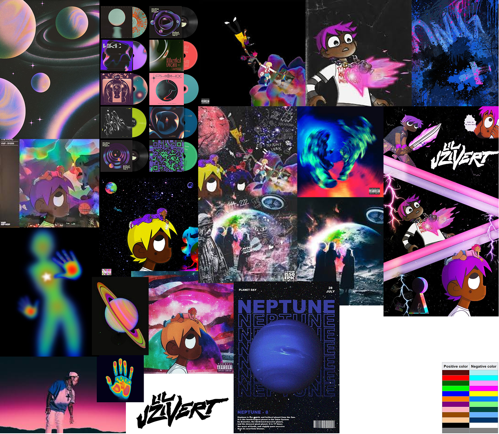

# Concept du projet

Nous avons choisi l’artiste **Lil Uzi Vert**, un rappeur américain qui mélange souvent le réel avec le dessin et l’animation, et qui fait beaucoup référence à l’espace.

Pour ce projet, nous avons imaginé un nouvel album basé sur l’univers spatial. Chaque musique est représentée par une planète ou un astre.  
La cover de l’album mélange l’univers du rap et celui de l’espace.

L’objectif est de permettre à l’utilisateur de **créer sa propre planète grâce à la personnalisation de la cover**.  
Il peut modifier le motif et les couleurs de la planète, ainsi que le dessin du rappeur et le fond.

Moodboard :

.
